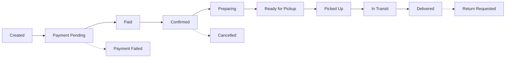
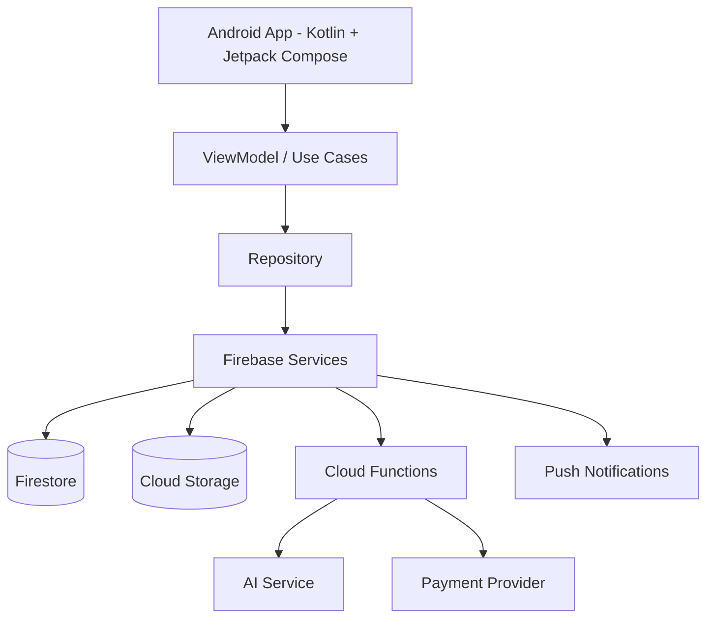

<div align="center">

# ✨ AI ARTISAN HUB

### AI-Powered Artisan Marketplace & Social Commerce Platform

**Discover • Create • Connect • Sell • Deliver**


</div>

---

## 📑 Table of Contents

- [About the Project](#-about-the-project)
- [Project Vision](#-project-vision)
- [User Roles](#-user-roles)
- [Key Features](#-key-features)
- [AI System](#-ai-system)
- [How It Works](#-how-it-works)
- [Tech Stack](#-tech-stack)
- [Project Structure](#-project-structure)
- [Documentation](#-documentation)
- [Roadmap](#-roadmap)

---

## 🌟 About the Project

**AI ARTISAN HUB** is an AI-powered digital marketplace and social-commerce platform that connects four groups in one ecosystem:

| | Role | What they do |
|---|---|---|
| 🧑‍🎨 | **Artisans** | Create and sell handmade products, share stories |
| 🛍️ | **Buyers** | Discover, chat, purchase and track products |
| 🚚 | **Delivery Partners** | Pick up and deliver orders |
| 🛡️ | **Administrators** | Operate, moderate and analyze the platform |

The platform combines **AI assistance, marketplace commerce, social discovery, real-time communication, delivery operations and a premium motion-based UI**.

---

## 🎯 Project Vision

AI ARTISAN HUB is designed to be much more than a traditional shopping app.

- 🎨 **Creator Economy** – a professional digital storefront for every artisan, no technical skills needed
- 🤖 **Artificial Intelligence** – a separate AI assistant for each dashboard, not one generic chatbot
- 📸 **Social Commerce** – Instagram-style stories, posts and short videos linked directly to products
- 💬 **Real-Time Communication** – chat, voice messages and mentions
- 📦 **Connected Logistics** – orders, payments and delivery in one flow
- 💎 **Premium Experience** – live backgrounds, smooth animations, accessible design

---

## 👥 User Roles

| Role | Main Purpose | Dashboard |
|---|---|---|
| 🧑‍🎨 Artisan | Create, manage and sell handmade products | Home, Products, Orders, Earnings, Stories, AI Studio, Messages |
| 🛍️ Buyer | Discover, interact, purchase and track | Feed, Explore, Cart, Orders, Chats, Stories, AI Shopping |
| 🚚 Delivery Partner | Accept and complete deliveries | Jobs, Map, Pickup, Delivery, Proof, Earnings, AI Route |
| 🛡️ Admin | Operate, moderate and analyze | Users, Products, Orders, Finance, Delivery, Content, AI, Analytics |

> One authentication system with a **role attribute** and **server-side authorization**. The app shows only relevant UI; the backend enforces the real permissions.

---

## 🚀 Key Features

<details open>
<summary><b>🧑‍🎨 Artisan Dashboard</b></summary>

- Store profile, verification and settings
- Product Studio (photos, video, price, stock, variants, shipping)
- Smart Catalog with AI-assisted title, description and tags
- Inventory with low-stock alerts
- Order Center, Earnings and payouts
- Story Studio, Customer Chat, Promotion Center, Insights
</details>

<details>
<summary><b>🛍️ Buyer Dashboard</b></summary>

- Personalized home feed and Explore
- Natural-language and visual search
- Cart, wishlist, checkout and order tracking
- Reviews, follow system, stories and posts
</details>

<details>
<summary><b>🚚 Delivery Partner Dashboard</b></summary>

- Online/offline status and job queue
- Navigation and stop sequence
- Status flow: accepted → picked up → in transit → delivered
- Proof of delivery (OTP / photo), exceptions and earnings
</details>

<details>
<summary><b>🛡️ Admin Dashboard</b></summary>

- Executive overview, user management, artisan verification
- Product and content moderation
- Payments, reconciliation and delivery operations
- Analytics, notification center and audit logs
</details>

### 📸 Instagram-Style Social Layer

| Feature | Working |
|---|---|
| Stories | 24-hour photo/video with product stickers and mentions |
| Posts | Image/video posts with product tags, likes, comments, saves |
| Short Videos | Vertical craft-process videos linked to products |
| Follow | Follow artisans and get relevant updates |
| Mentions & Hashtags | `@username` and craft/category tags |
| Collections | Private buyer collections (Gifts, Home Decor, Favorites) |

### 💬 Communication

Buyer–artisan chat • order-linked conversations • voice messages • product cards • typing indicator • reactions • block / mute / report

---

## 🤖 AI System

Every dashboard gets its own intelligent assistant:

| Dashboard | AI Mode | Focus |
|---|---|---|
| 🧑‍🎨 Artisan | **Artisan Copilot** | Product writer, pricing helper, content creator, stock forecast |
| 🛍️ Buyer | **Smart Shopping Assistant** | Visual search, gift assistant, compare, review summary |
| 🚚 Delivery | **Route & Operations Copilot** | Route planner, ETA, task priority, exception help |
| 🛡️ Admin | **Operations Intelligence Center** | Anomaly detection, moderation copilot, analytics, forecasting |

**AI safety rules**
- AI drafts, humans confirm – factual claims (material, origin, dimensions) must be reviewed by the artisan
- AI never bans users on its own – moderation decisions stay with humans
- Secret API keys live only on the backend, never inside the Android app

---

## ⚙️ How It Works

### Order Lifecycle



### Platform Architecture



---

## 🧰 Tech Stack

| Layer | Technology |
|---|---|
| Android | Kotlin + Jetpack Compose |
| UI | Material 3 + custom design system |
| Architecture | MVVM / clean layered |
| Auth | Firebase Authentication |
| Database | Cloud Firestore |
| Media | Cloud Storage |
| Backend | Cloud Functions |
| Notifications | Firebase Cloud Messaging |
| Monitoring | Firebase Analytics + Crashlytics |
| Animation | Compose Animation + Lottie |

Full details: [docs/tech-stack.md](docs/tech-stack.md)

---

## 🗂️ Project Structure

```text
AI_ARTISAN_HUB/
├── docs/
│   ├── ai-system.md
│   ├── architecture.md
│   ├── database-design.md
│   ├── features.md
│   ├── roadmap.md
│   ├── user-roles.md
│   ├── user-flows.md
│   ├── tech-stack.md
│   ├── security.md
│   ├── notifications-analytics.md
│   ├── testing.md
│   ├── social-layer.md
│   ├── chat-communication.md
│   ├── marketplace-catalog.md
│   ├── orders-payments.md
│   ├── ui-ux-design.md
│   ├── future-features.md
│   └── product-strategy.md
├── .gitignore
└── README.md
```

---

## 📚 Documentation

| Document | Description |
|---|---|
| [Features](docs/features.md) | Complete feature list for all dashboards |
| [User Roles](docs/user-roles.md) | Roles and permissions |
| [AI System](docs/ai-system.md) | Role-specific AI assistants |
| [Architecture](docs/architecture.md) | System design |
| [Database Design](docs/database-design.md) | Data entities and structure |
| [User Flows](docs/user-flows.md) | Step-by-step workflows |
| [Tech Stack](docs/tech-stack.md) | Technology choices |
| [Security](docs/security.md) | Security and privacy rules |
| [Notifications & Analytics](docs/notifications-analytics.md) | Events, alerts and metrics |
| [Testing](docs/testing.md) | Test plan |
| [Social Layer](docs/social-layer.md) | Stories, posts, follow, mentions |
| [Chat & Communication](docs/chat-communication.md) | Real-time chat and voice |
| [Marketplace & Catalog](docs/marketplace-catalog.md) | Products, search, recommendations |
| [Orders & Payments](docs/orders-payments.md) | Checkout, payments, delivery |
| [UI & Motion](docs/ui-ux-design.md) | Premium UI and animation rules |
| [Future Features](docs/future-features.md) | Planned advanced modules |
| [Product Strategy](docs/product-strategy.md) | MVP-to-advanced plan |
| [Roadmap](docs/roadmap.md) | Development phases |

---

## 🛣️ Roadmap

| Phase | Focus |
|---|---|
| 1 | Foundation – project setup, auth, roles |
| 2 | Marketplace – products, catalog, search, cart |
| 3 | Orders & Payments |
| 4 | Delivery |
| 5 | Social layer |
| 6 | Chat & voice |
| 7 | AI assistants |
| 8 | Premium UI & motion |
| 9 | Security hardening & release |

See the full [roadmap](docs/roadmap.md).

---

<div align="center">

**Made with ❤️ for artisans and the people who love their craft**

</div>
