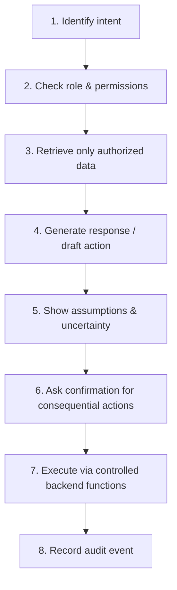

# 🤖 AI System

Instead of one generic chatbot, every dashboard has its **own role-specific AI assistant**.

| Dashboard | AI Mode | Main Context |
|---|---|---|
| 🧑‍🎨 Artisan | **Artisan Copilot** | Products, catalog, sales, inventory, content, customer questions |
| 🛍️ Buyer | **Smart Shopping Assistant** | Products, preferences, searches, orders, reviews, discovery |
| 🚚 Delivery | **Route & Operations Copilot** | Assigned jobs, route data, ETA, exceptions, earnings |
| 🛡️ Admin | **Operations Intelligence Center** | Platform metrics, moderation, incidents, finance, support |

## 🧑‍🎨 Artisan Copilot

- **Product Writer** – title, description and caption drafts from basic details
- **Visual Catalog AI** – suggests category, colors, materials and tags from images
- **Pricing Helper** – pricing framework from material cost, labor, packaging, platform fee, desired margin
- **Content Creator** – story ideas, captions, launch messages
- **Sales Insights** – summary of views, saves, cart additions, orders, revenue
- **Customer Reply Assistant** – drafts answers to common buyer questions
- **Stock Forecast** – flags products that may need restocking
- **Business Coach** – turns metrics into simple suggestions

## 🛍️ Smart Shopping Assistant

- **Visual Search** – upload an image, find related products
- **Conversational Discovery** – describe a need in natural language
- **Gift Assistant** – occasion, recipient, style, budget → shortlist
- **Compare Assistant** – price, dimensions, material, delivery estimate, reviews
- **Personalized Discovery** – recommendations using permitted signals and privacy controls
- **Order Assistant** – explains order status and available actions
- **Review Summarizer** – recurring review themes, with the number of reviews shown
- **Support Assistant** – returns, order questions, app navigation

## 🚚 Route & Operations Copilot

- **Route Planner** – organizes multiple stops
- **ETA Assistant** – arrival estimate and delay signals
- **Task Prioritizer** – highlights time-sensitive jobs
- **Exception Assistant** – guides failed-delivery workflows
- **Voice Mode** – short hands-free commands where safe
- **Daily Summary** – jobs, metrics, earnings

> Safety: keep interaction minimal while a vehicle is moving.

## 🛡️ Operations Intelligence Center

- **Anomaly Detection** – flags unusual cancellations, refunds, payments for human review
- **Moderation Copilot** – prioritizes content for human moderators
- **Business Analyst** – answers questions from authorized metrics, showing the measurements
- **Support Copilot** – summarizes tickets, drafts replies
- **Forecasting** – scenario-based forecasts with assumptions
- **Incident Summarizer** – turns events into a concise timeline
- **AI Governance Panel** – model usage, versions, failures, approval rules, human overrides

## 🔁 Standard AI Request Flow

## 🛑 Safety Rules

- AI-generated facts (material, origin, certification, dimensions) must be **confirmed by the artisan** before publishing
- AI **never bans users on its own** – humans make moderation decisions
- Privileged AI operations run through a **trusted backend**
- Secret API keys and database credentials are **never** embedded in the Android app

See also: [Security](security.md) · [Architecture](architecture.md)
