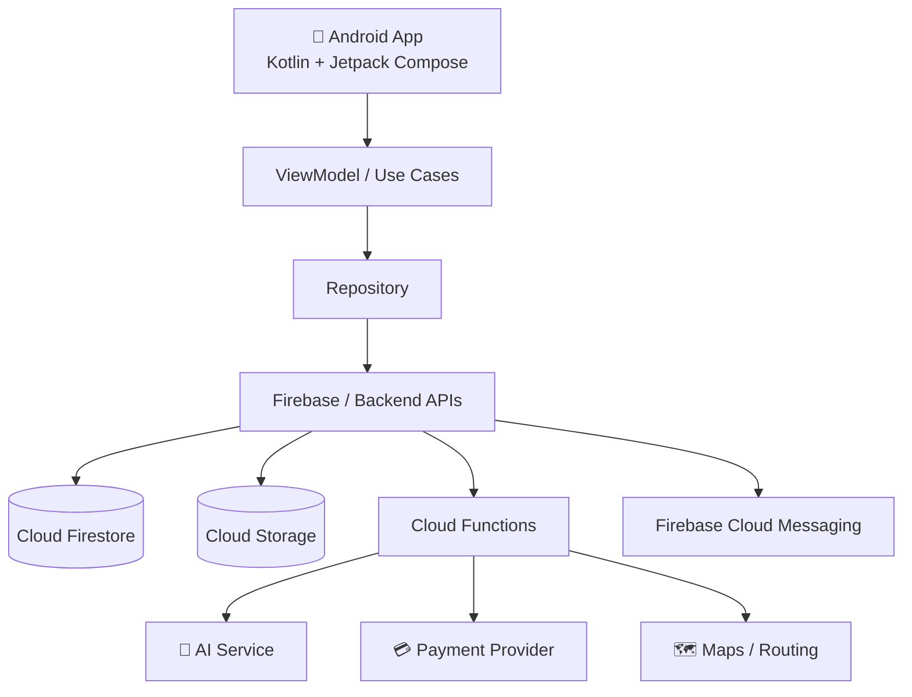
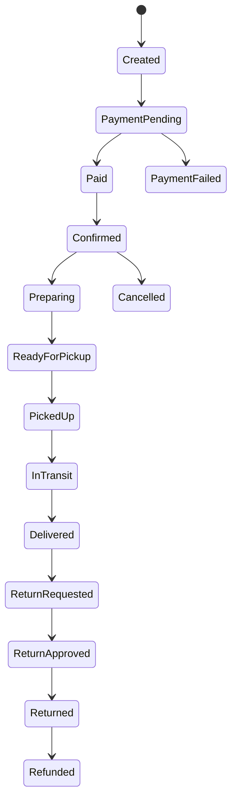

# 🏗️ Architecture

## Overview

## Layers

| Layer | Responsibility |
|---|---|
| UI (Compose) | Screens, navigation, animation |
| ViewModel / Use Cases | UI state and business rules |
| Repository | Single source of data for the app |
| Firebase / Backend | Auth, database, storage, functions, messaging |
| External services | AI model, payment gateway, maps |

## Backend Principles

- The **client is never trusted** for authorization
- Business-critical state transitions happen on the **backend**
- Use **server timestamps** for important events
- Use indexes and query planning for high-volume collections
- Separate **public profile data** from **private account/security data**
- Store large media in **object storage**, not database documents
- Keep **audit logs** append-only and protected

## Order State Machine

## Payments

- Payment gateway abstraction (not tied to one provider)
- Server-side payment verification and webhook handling
- Idempotent callbacks to prevent duplicate orders
- Server-side coupon validation
- Invoice / receipt generation
- Refund workflow with full status history

## Real-Time Chat

Message created → backend validates sender → message stored → recipient updated in real time → notification sent → read state updated.

Media: record/select → compress → secure upload → create media reference → send metadata → recipient loads via authorized access.

See also: [Database Design](database-design.md) · [Tech Stack](tech-stack.md) · [Security](security.md)
