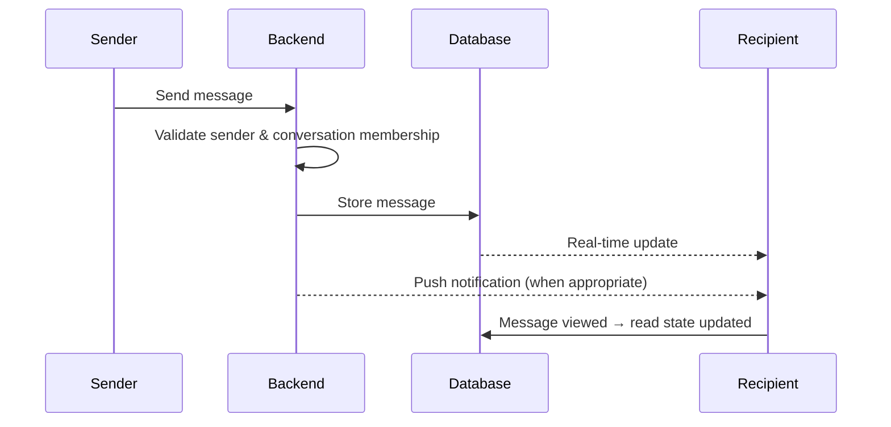

# 💬 Chat, Voice & Real-Time Communication

## Features

- One-to-one buyer–artisan chat
- Order-linked conversations (order ID shown in the chat header)
- Image and product-card sharing
- Voice messages: recording, upload state, duration, playback
- Typing indicator and optional online / last-seen status
- Message reactions and reply-to-message
- `@mentions` in messages and comments
- Read / delivery states
- Block, mute and report controls
- Admin / support conversation for issue resolution
- Search within the user's own conversations

## Real-Time Message Flow

## Media Workflow

Record / select media → compress where appropriate → secure upload → create media reference → send message metadata → recipient loads media through **authorized access**.

## Safety Controls

| Control | Purpose |
|---|---|
| Block | Stop all contact from a user |
| Mute | Silence notifications from a conversation |
| Report | Send a message or user to admin moderation |

See also: [Social Layer](social-layer.md) · [Notifications & Analytics](notifications-analytics.md)
