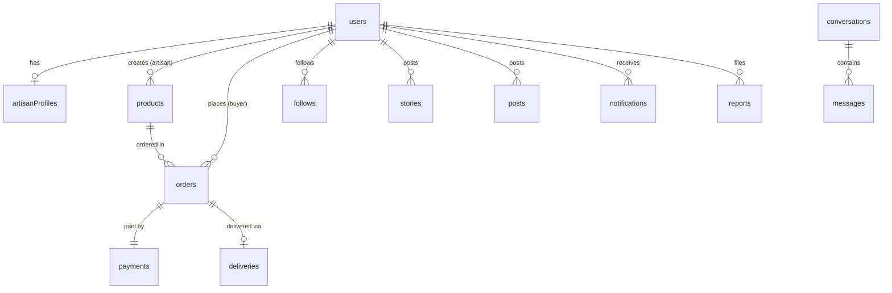

# 🗄️ Database Design

Database: **Cloud Firestore** (real-time, structured data). Large media is stored in **Cloud Storage**.

## Core Entities

| Entity | Important Fields |
|---|---|
| `users` | uid, role, name, photoUrl, status, createdAt |
| `artisanProfiles` | uid, craftType, bio, verification, storeSettings |
| `products` | productId, artisanId, title, media, price, stock, variants, status |
| `stories` | storyId, authorId, media, createdAt, expiresAt |
| `posts` | postId, authorId, media, caption, productRefs, createdAt |
| `follows` | followerId, followingId, createdAt |
| `conversations` | conversationId, participantIds, lastMessage, updatedAt |
| `messages` | messageId, conversationId, senderId, type, content, mediaRef, createdAt |
| `orders` | orderId, buyerId, artisanId, deliveryId, items, totals, status |
| `payments` | paymentId, orderId, provider, amount, status, timestamps |
| `deliveries` | deliveryId, orderId, partnerId, status, pickup/drop data |
| `notifications` | notificationId, userId, type, payload, readAt |
| `reports` | reportId, reporterId, targetType, targetId, reason, status |
| `auditLogs` | logId, actorId, action, target, timestamp |

## Relationships

## Design Rules

- Separate public profile data from private account data
- Use server timestamps for `createdAt`, `updatedAt`, `expiresAt`
- Stories expire after **24 hours** (`expiresAt`)
- Product lifecycle: `draft → pending review → published → paused → out of stock → archived`
- `auditLogs` are append-only; ordinary users cannot read or edit them
- Add indexes for high-volume queries (feed, orders, messages)

See also: [Architecture](architecture.md) · [Security](security.md)
