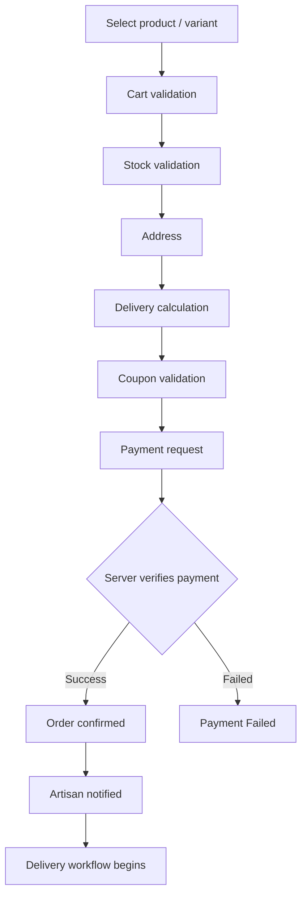

# 💳 Orders, Payments, Returns & Delivery

## Order State Machine

**Main path:** Created → Payment Pending → Paid → Confirmed → Preparing → Ready for Pickup → Picked Up → In Transit → Delivered

**Exception branches:** Payment Failed • Cancelled • Return Requested • Return Approved • Returned • Refunded

## Checkout Flow

## Payment Rules

- Payment gateway abstraction (not tied to one provider)
- Server-side payment verification and webhook handling
- Idempotent callbacks to prevent duplicate orders
- Server-side coupon validation
- Invoice / receipt generation
- Refund workflow with complete status history

## Delivery Rules

- Delivery is assigned after the order is ready for fulfillment, per business rules
- Proof-of-delivery records are linked to the order
- Buyers see a timeline of major order events

## Delivery Status Flow

`Accepted → At pickup → Picked up → In transit → Nearby → Delivered / Failed`

**Proof of delivery:** OTP, signature/photo where appropriate, timestamp, delivery notes.

**Exceptions:** customer unavailable, address issue, damaged package, seller delay.

See also: [Architecture](architecture.md) · [Security](security.md)
