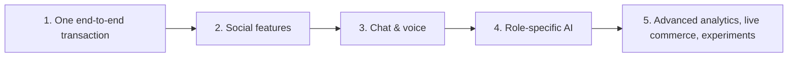

# 🧭 Product Definition & Implementation Strategy

## Final Product Concept

AI ARTISAN HUB works as **four connected products in one ecosystem**:

| Product | For |
|---|---|
| 🧑‍🎨 Creator / business tool | Artisans |
| 🛍️ Social shopping experience | Buyers |
| 🚚 Focused logistics workspace | Delivery partners |
| 🛡️ Operations / control center | Admins |

**Central differentiator:** role-specific AI + social commerce + real-time communication + delivery workflow + premium motion design.

## MVP-to-Advanced Strategy

**Step 1 – core transaction:** artisan creates product → buyer discovers it → buyer orders → delivery partner delivers → buyer reviews.

## Production Rules

- Every AI result that affects a user, listing, payment, moderation action or delivery action needs validation and/or human confirmation
- All critical business actions are authorized **server-side**
- Keep the Android UI responsive on smaller and lower-end devices
- Treat privacy, moderation, payment security and delivery safety as **first-class requirements**
- Use **feature flags** to release advanced modules gradually

## Primary Goals

- Professional digital storefront for artisans, no technical skills needed
- Authentic handmade product discovery for buyers
- Focused workspace for delivery partners
- Complete operational visibility for admins
- A separate AI assistant for each dashboard
- Premium interface with good performance and accessibility

> Exact cloud costs, payment-provider terms, AI model pricing, legal requirements and third-party API capabilities should be re-checked at implementation time.
