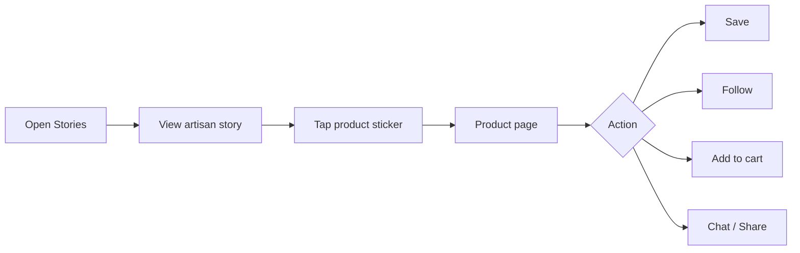

# 📸 Instagram-Style Social Layer

The social layer turns the marketplace into a **discovery and community experience** while keeping the platform's own brand identity.

| Feature | Working |
|---|---|
| 📖 **Stories** | 24-hour photo/video stories with optional product stickers, captions and mentions |
| 🖼️ **Posts** | Image/video posts with captions, product tags, likes, comments, saves and shares |
| 🎬 **Short Videos** | Vertical craft/process videos with product linking |
| ➕ **Follow** | Follow artisans and receive relevant feed and notification updates |
| 🏷️ **Mentions** | `@username` in captions and comments; notifications follow privacy settings |
| #️⃣ **Hashtags** | Craft/category tags for discovery |
| 🗂️ **Collections** | Private buyer collections such as Gifts, Home Decor, Favorites |
| 🔴 **Live / Events** | Future module for live demos, launches and product drops |

## Social Feed Logic

- Prioritize followed artisans and relevant product content
- Mix fresh content with marketplace discovery
- Show product cards directly inside social content
- Let users save content and products for later
- Apply moderation and reporting tools to all user-generated content
- Keep promotional notifications separate from essential operational notifications

## Story → Purchase Flow

See also: [Chat & Communication](chat-communication.md) · [Security](security.md)
