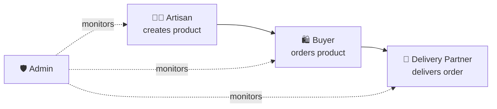

# 👥 User Roles

AI ARTISAN HUB has **four roles**, each with its own dashboard.

| Role | Main Purpose | Navigation |
|---|---|---|
| 🧑‍🎨 **Artisan** | Create, manage and sell handmade products | Home • Products • Orders • Earnings • Social • Messages • AI • Profile |
| 🛍️ **Buyer** | Discover, interact, purchase and track products | Home • Explore • Add/Cart • Orders • Messages • Profile |
| 🚚 **Delivery Partner** | Accept and complete assigned deliveries | Jobs • Active Route • History • Earnings • Profile |
| 🛡️ **Admin** | Operate, moderate and analyze the platform | Overview • Users • Products • Orders • Delivery • Content • Finance • Analytics • Settings |

## Access Model

- One authentication system with a **role attribute**
- The app shows only the UI relevant to the role
- The **backend / database enforces the real permissions** — the client is never trusted

## Permission Summary

| Action | Artisan | Buyer | Delivery | Admin |
|---|:---:|:---:|:---:|:---:|
| Manage own products | ✅ | ❌ | ❌ | ✅ |
| Place orders | ❌ | ✅ | ❌ | ✅ |
| Manage assigned delivery | ❌ | ❌ | ✅ | ✅ |
| Moderate content | Limited / report | Report | Report | ✅ |
| View platform analytics | Own | Own activity | Own delivery | ✅ |
| Manage users | ❌ | ❌ | ❌ | ✅ |

## Role Journey

See also: [Security](security.md) · [Features](features.md)
